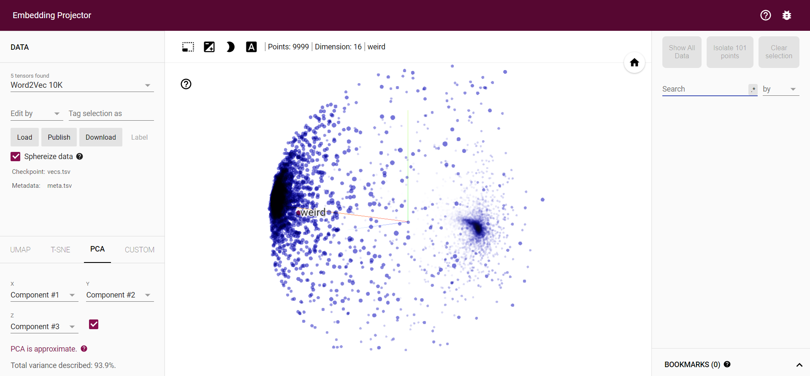

# sarcasm-detection-tensorflow

Use [Embedding Projector (projectortensorflow.org)](https://projector.tensorflow.org/) for visualizing word embeddings by loading meta.tsc and vecs.tsv.

## TensorFlow Projector
TensorFlow Projector is visuale tool that let the user intercat and analyze high demensional data (e.g. embeddings) and their metadata, by projecting them in a 3D space on the browser.

## Screenshots
